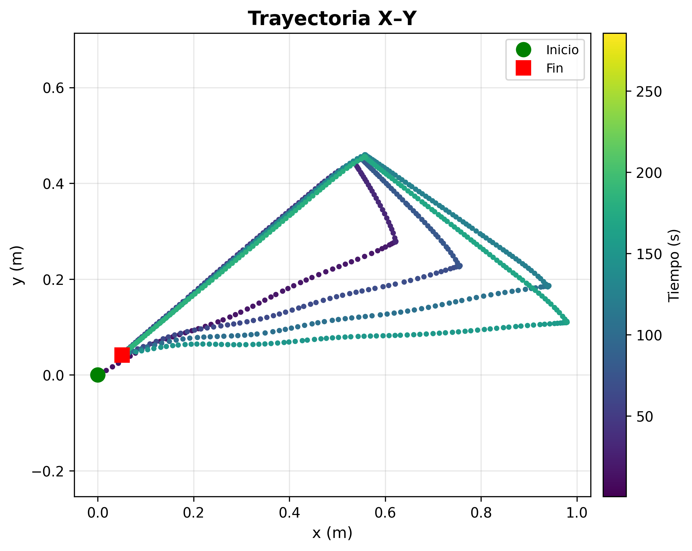

# Visual Servoing para Puzzlebot con Sampled MPC

Este proyecto implementa un sistema de navegación autónoma basada en visión para el Puzzlebot utilizando un controlador MPC. El robot detecta cajas de colores utilizando una Raspberry Pi Camera v2, estima la distancia relativa y el error angular directamente desde características visuales de la imagen, y se aproxima autónomamente al objetivo mediante visual servoing.

Después de alcanzar la distancia deseada, el robot navega hacia un waypoint de entrega y finalmente regresa a su posición inicial utilizando control basado en odometría.

---

# Descripción General del Sistema

El sistema integra:

- Percepción visual usando OpenCV
- Estimación relativa del estado $(\rho,\alpha)$
- Sampled Model Predictive Control (MPC)
- Odometría diferencial
- Máquina de estados finitos (FSM)
- Navegación hacia waypoints y regreso a home

Flujo principal de la misión:

```text
WAIT_COMMAND
    ↓
TRACK_TARGET (Visual Servoing + MPC)
    ↓
COLLECTING
    ↓
GO_TO_WAYPOINT
    ↓
RETURN_HOME
    ↓
WAIT_COMMAND
````

---

# Estructura del Repositorio

```text
.
├── calibration
│   ├── analyze_calibration.py
│   └── calibration_data.csv
├── launch
│   └── puzzlebot_mpc.launch.py
├── media
│   ├── 01_trajectory_xy.png
│   ├── 02_position_vs_time.png
│   ├── 03_orientation_vs_time.png
│   ├── 04_velocity_commands.png
│   ├── 05_distance_error.png
│   ├── 06_angular_error.png
│   ├── 07_mpc_cost.png
│   ├── 08_robot_state.png
│   ├── 09_target_detection.png
│   ├── analisis.py
│   └── mpc_results.csv
├── puzzlebot_box_mpc
│   ├── calibration_node.py
│   ├── mpc_hw.py
│   ├── puzzlebot_odometry.py
│   └── teleop.py
├── package.xml
├── setup.py
└── README.md
```

## Descripción de Directorios

### `puzzlebot_box_mpc/`

Contiene los nodos principales ROS2 del proyecto.

---

#### `mpc_hw.py`

Nodo principal del sistema.

Implementa:

- detección de color,
- selección de objetivo,
- estimación de distancia y ángulo,
- Sampled MPC,
- máquina de estados finitos (FSM),
- navegación hacia waypoint,
- controlador de regreso,
- almacenamiento de datos en CSV.

---

#### `puzzlebot_odometry.py`

Nodo ROS2 encargado de calcular la odometría diferencial utilizando las velocidades de las ruedas medidas por encoders.

Publica:

```text
/odom
```

---

#### `teleop.py`

Interfaz de teclado utilizada para enviar comandos al robot.

Permite:

- seleccionar color objetivo,
- enviar waypoints,
- regresar a home,
- cancelar misiones.

---

#### `calibration_node.py`

Nodo utilizado para generar datos experimentales para la calibración del modelo predictivo.

Realiza:

- pruebas lineales,
- pruebas angulares,
- calibración de distancia focal,
- registro de datos visuales.

---

### `calibration/`

Incluye herramientas y datos utilizados para calibrar el modelo predictivo.

---

#### `analyze_calibration.py`

Script offline utilizado para estimar:

- $K_\rho$
- $K_\alpha$

del modelo predictivo utilizado por el MPC.

---

#### `calibration_data.csv`

Archivo CSV con los datos experimentales registrados durante las pruebas de calibración.

---

### `media/`

Contiene resultados experimentales y gráficas generadas durante las pruebas.

Incluye:

- trayectoria del robot,
- errores visuales,
- señales de control,
- evolución temporal,
- estados de la FSM,
- resultados almacenados en CSV.

---

### `launch/`

Contiene launch files ROS2 utilizados para ejecutar el sistema.


---

# Topics ROS2

## Topics Suscritos

| Topic                | Tipo                | Descripción          |
| -------------------- | ------------------- | -------------------- |
| `/video_source/raw`  | `sensor_msgs/Image` | Stream de cámara |
| `/odom`              | `nav_msgs/Odometry` | Odometría del robot  |
| `/box_color_command` | `std_msgs/String`   | Comandos del usuario |

---

## Topics Publicados

| Topic      | Tipo                  | Descripción             |
| ---------- | --------------------- | ----------------------- |
| `/cmd_vel` | `geometry_msgs/Twist` | Comandos de velocidad   |
| `/odom`    | `nav_msgs/Odometry`   | Pose estimada del robot |

---

# Cómo Ejecutar

---

## 1. Ejecutar Nodo de Odometría

```bash
python3 puzzlebot_odometry.py
```

Este nodo estima la pose del robot utilizando las velocidades de las ruedas.

---

## 2. Ejecutar Nodo Principal MPC

```bash
python3 mpc_hw.py
```

Este nodo ejecuta:

* percepción visual,
* controlador MPC,
* FSM,
* navegación,
* sistema de logging.

---

## 3. Ejecutar Interfaz de Comandos

```bash
python3 teleop.py
```

Esto abre la interfaz de teclado para enviar comandos al robot.

---

# Comandos de Teleoperación

| Tecla   | Acción               |
| ------- | -------------------- |
| `g`     | Seguir caja verde    |
| `p`     | Seguir caja rosa     |
| `h`     | Regresar a home      |
| `w x y` | Ir a waypoint        |
| `c`     | Cancelar misión      |
| `q`     | Salir                |

Ejemplo:

```text
w 1.5 2.0
```

envía al robot al waypoint:

```text
(1.5 , 2.0)
```


# Datos Experimentales Registrados

Durante la ejecución de la prueba, se registraron los datos para su posterior analisis, en:

```text
mpc_results.csv
```

El archivo incluye:

| Variable          | Descripción            |
| ----------------- | ---------------------- |
| `rho`             | Distancia estimada     |
| `alpha`           | Error angular          |
| `v_cmd`           | Velocidad lineal       |
| `w_cmd`           | Velocidad angular      |
| `cost`            | Costo MPC              |
| `x,y,theta`       | Pose odométrica        |
| `state`           | Estado de la FSM       |
| `target_detected` | Indicador de detección |

---

# Resultados

El sistema fue validado experimentalmente sobre un Puzzlebot real.

El robot logró realizar exitosamente:

* seguimiento visual,
* aproximación autónoma,
* navegación hacia waypoint,
* regreso a home,
* múltiples ciclos completos de misión.

---

# Ejemplo de Trayectoria

Se muestra la imagen de la trayectoria:



---

# Autor

José Eduardo Sánchez Martínez

