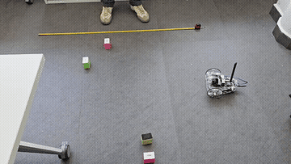
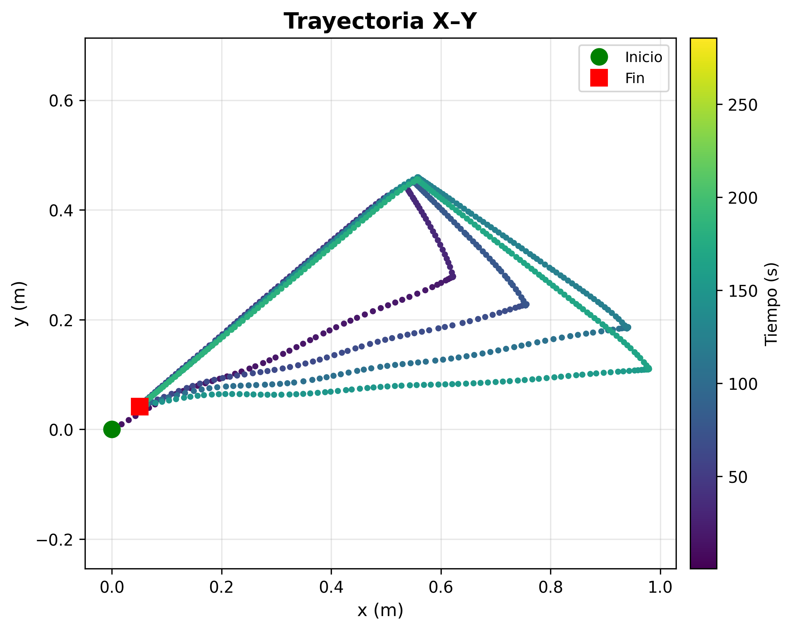
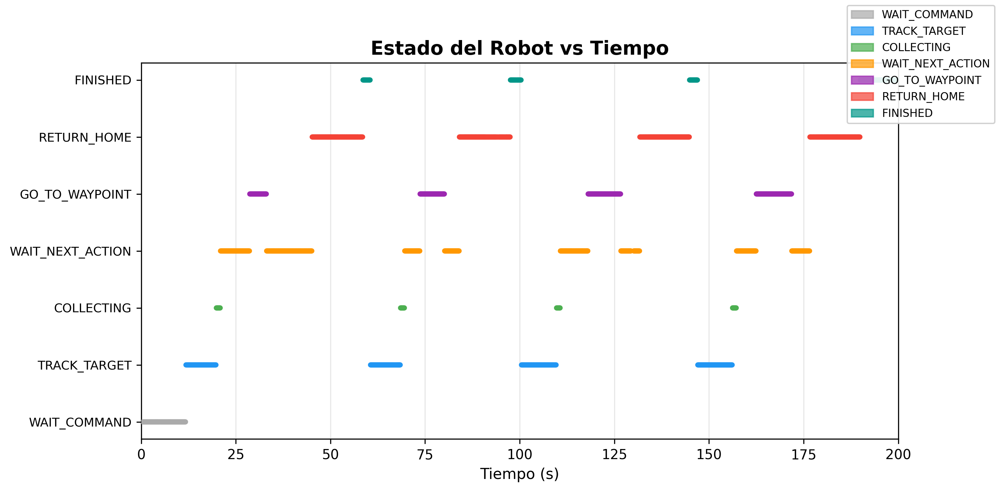
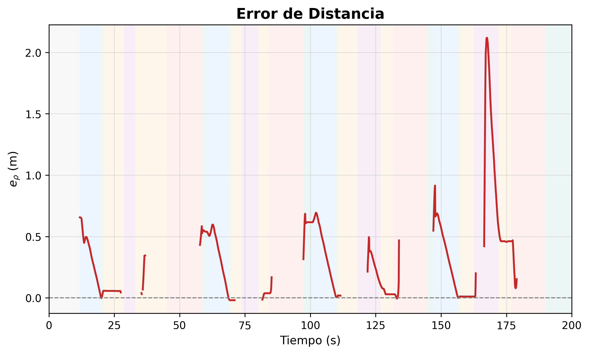
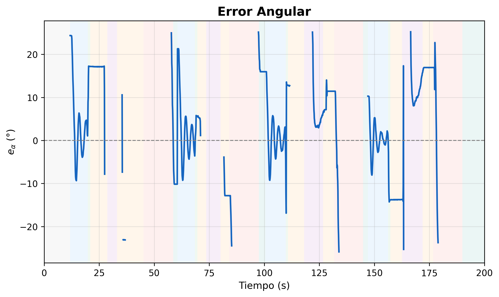
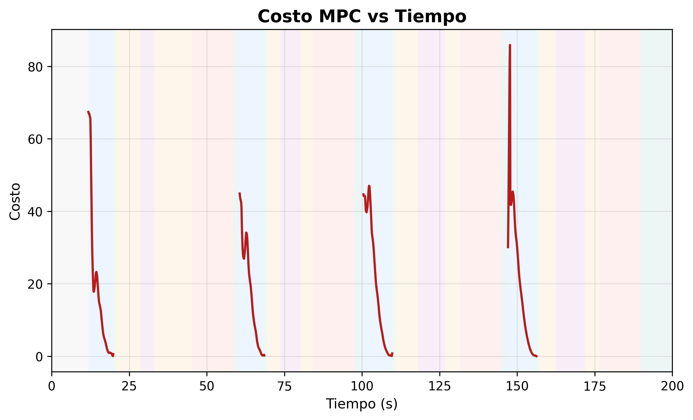
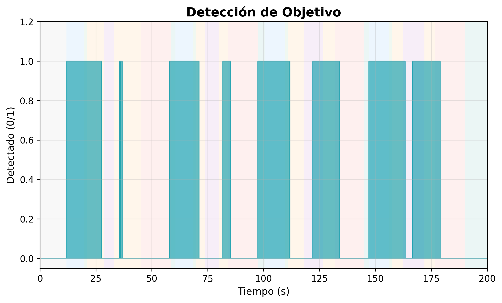

# Visual Servoing for Puzzlebot with Sampled MPC

<p align="center">
  
</p>
<p align="center"><em>The Puzzlebot detecting the target box and closing in on it via visual servoing. Full run: see <a href="#report-and-video">Report and Video</a>.</em></p>

<p align="center">
  
  
  
  
</p>

## Description

ROS 2 package (Python, `ament_python`) that implements a vision-based autonomous navigation system for the Puzzlebot using an MPC controller. The robot detects colored boxes with a Raspberry Pi Camera v2, estimates the relative distance and angular error directly from visual features, and autonomously approaches the target through visual servoing.

After reaching the desired distance, the robot navigates to a delivery waypoint and finally returns to its initial position using odometry-based control.

The system integrates:

- Visual perception using OpenCV
- Relative state estimation $(\rho,\alpha)$
- Sampled Model Predictive Control (MPC)
- Differential-drive odometry
- Finite state machine (FSM)
- Waypoint navigation and return-to-home

## Table of Contents

- [System Overview](#system-overview)
- [Package Contents](#package-contents)
- [How It Works](#how-it-works)
- [ROS 2 Topics](#ros-2-topics)
- [Requirements](#requirements)
- [Workspace Installation / Setup](#workspace-installation--setup)
- [How to Launch It](#how-to-launch-it)
- [Teleoperation Commands](#teleoperation-commands)
- [Recorded Experimental Data](#recorded-experimental-data)
- [Results](#results)
- [Report and Video](#report-and-video)
- [Authors](#authors)

---

# System Overview

Main mission flow:

```text
WAIT_COMMAND
    ↓
TRACK_TARGET (Visual Servoing + MPC)
    ↓
COLLECTING
    ↓
GO_TO_WAYPOINT
    ↓
RETURN_HOME
    ↓
WAIT_COMMAND
```

---

# Package Contents

```
puzzlebot_box_mpc/
├── puzzlebot_box_mpc/              # ROS 2 package (ament_python)
│   ├── puzzlebot_box_mpc/
│   │   ├── mpc_hw.py               # Main node: vision, Sampled MPC, FSM, return/waypoint control
│   │   ├── puzzlebot_odometry.py   # Differential-drive odometry node
│   │   ├── teleop.py               # Keyboard interface to send commands
│   │   └── calibration_node.py     # Node used to record calibration data
│   ├── launch/puzzlebot_mpc.launch.py
│   ├── resource/puzzlebot_box_mpc
│   ├── test/
│   ├── package.xml
│   └── setup.py / setup.cfg
├── calibration/                    # Offline calibration of the MPC model
│   ├── data/calibration_data.csv
│   └── scripts/analyze_calibration.py
├── results/                        # Experimental results from mission runs
│   ├── data/mpc_results.csv
│   ├── plots/                      # Generated figures (trajectory, errors, commands, ...)
│   └── scripts/analisis.py
├── report/Challenge_Visual_Servoing.pdf  # Challenge report
└── README.md
```

---

# How It Works

1. **`mpc_hw.py`** is the main execution node (`ros2 run puzzlebot_box_mpc mpc_hw`):
   - Subscribes to the camera stream, detects the commanded box color (HSV thresholding + contours), and picks the closest candidate (largest apparent area) as the target.
   - Estimates the relative state $(\rho, \alpha)$ from the target's bounding box: $\alpha$ from the pixel offset to the image center, $\rho$ from the known box width and the calibrated focal length, filtered with a moving average.
   - Runs a **Sampled MPC**: it evaluates a grid of `(v, w)` candidates, rolls out the calibrated model `rho(k+1) = rho(k) - K_rho * v * cos(alpha(k)) * dt`, `alpha(k+1) = alpha(k) - K_alpha * w(k) * dt` over a fixed horizon, and picks the pair that minimizes a quadratic cost on tracking error and control effort/smoothness.
   - Drives a finite state machine (`WAIT_COMMAND → TRACK_TARGET → COLLECTING → WAIT_NEXT_ACTION → GO_TO_WAYPOINT / RETURN_HOME`), using a proportional odometry-based controller for the waypoint and return-home phases.
   - Logs every frame (state, $(\rho,\alpha)$, commands, MPC cost, pose) to `mpc_results.csv`.

2. **`puzzlebot_odometry.py`** integrates wheel encoder velocities (`VelocityEncR` / `VelocityEncL`) into a differential-drive dead-reckoning pose and publishes `nav_msgs/Odometry` on `/odom`.

3. **`teleop.py`** is a keyboard interface (run on a laptop) that publishes color/home/waypoint/cancel commands to `/box_color_command`.

4. **`calibration_node.py`** and **`calibration/scripts/analyze_calibration.py`** are used offline, before running the mission: the node drives fixed linear/angular test trials while logging vision data, and the script fits $K_\rho$ and $K_\alpha$ from that data — the values then hardcoded as calibrated parameters in `mpc_hw.py`.

5. **`results/scripts/analisis.py`** reads `results/data/mpc_results.csv` and generates the plots under `results/plots/` (trajectory, position/orientation vs. time, velocity commands, distance/angular error, MPC cost, FSM state, target detection).

---

# ROS 2 Topics

### Subscribed

| Topic                 | Type                 | Description        |
| ---------------------- | -------------------- | ------------------- |
| `/video_source/raw`    | `sensor_msgs/Image`  | Camera stream        |
| `/odom`                | `nav_msgs/Odometry`  | Robot odometry       |
| `/box_color_command`   | `std_msgs/String`    | User commands         |

### Published

| Topic      | Type                   | Description               |
| ---------- | ---------------------- | -------------------------- |
| `/cmd_vel` | `geometry_msgs/Twist`  | Velocity commands           |
| `/odom`    | `nav_msgs/Odometry`    | Estimated robot pose        |

---

# Requirements

- ROS 2 (tested with the Puzzlebot's Jetson image)
- OpenCV (`cv2`), NumPy, `transforms3d`
- [`ros_deep_learning`](https://github.com/dusty-nv/ros_deep_learning) (`video_source` launch file, used for the camera stream)

The `puzzlebot_box_mpc` package must be installed in **two places**:

**On the Puzzlebot (Jetson)** — runs all the processing:
- `puzzlebot_box_mpc/puzzlebot_box_mpc/mpc_hw.py` — main node
- `puzzlebot_box_mpc/puzzlebot_box_mpc/puzzlebot_odometry.py` — odometry
- `puzzlebot_box_mpc/launch/puzzlebot_mpc.launch.py` — launch file

**On your laptop** — only to send commands:
- `puzzlebot_box_mpc/puzzlebot_box_mpc/teleop.py` — keyboard interface

The laptop only needs ROS 2 installed and to be connected to the Puzzlebot's hotspot.

---

# Workspace Installation / Setup

Build on your laptop:

```bash
cd ~/ros2_ws
colcon build --packages-select puzzlebot_box_mpc
source install/setup.bash
```

---

# How to Launch It

1. **Connect to the Puzzlebot over SSH**

   ```bash
   ssh puzzlebot@<PUZZLEBOT_IP>
   ```

2. **Build the package on the Puzzlebot**

   ```bash
   cd ~/ros2_ws
   colcon build --packages-select puzzlebot_box_mpc
   source install/setup.bash
   ```

3. **Run all nodes on the Puzzlebot**

   ```bash
   ros2 launch puzzlebot_box_mpc puzzlebot_mpc.launch.py
   ```

   This brings up automatically:
   - `puzzlebot_odometry` — differential-drive odometry
   - `mpc_hw` — visual perception, MPC and FSM
   - `video_source` — camera stream

4. **Run the teleop on your laptop** (terminal without SSH)

   ```bash
   source install/setup.bash
   ros2 run puzzlebot_box_mpc teleop
   ```

Both machines communicate over the Puzzlebot's hotspot network.

---

# Teleoperation Commands

| Key     | Action              |
| ------- | -------------------- |
| `g`     | Track the green box    |
| `p`     | Track the pink box     |
| `h`     | Return to home           |
| `w x y` | Go to waypoint            |
| `c`     | Cancel mission             |
| `q`     | Quit                        |

---

# Recorded Experimental Data

During test runs, data is logged for later analysis to:

```text
results/data/mpc_results.csv
```

The file includes:

| Variable          | Description             |
| ----------------- | ------------------------- |
| `rho`             | Estimated distance          |
| `alpha`           | Angular error                 |
| `v_cmd`           | Linear velocity command         |
| `w_cmd`           | Angular velocity command          |
| `cost`            | MPC cost                            |
| `x,y,theta`       | Odometric pose                        |
| `state`           | FSM state                               |
| `target_detected` | Detection flag                            |

---

# Results

The system was experimentally validated on a real Puzzlebot over **four complete mission cycles** (visual approach → collect → waypoint or return home). The plots below are generated by [`results/scripts/analisis.py`](results/scripts/analisis.py) from the logged run in [`results/data/mpc_results.csv`](results/data/mpc_results.csv); the colored background bands mark each FSM state.

<table>
<tr>
<td width="50%">

<p align="center"><b>Trajectory (X-Y)</b></p>

<p align="center">Four full approach-and-return loops, color-coded by elapsed time; the robot starts and ends near the origin each cycle.</p>

</td>
<td width="50%">

<p align="center"><b>Robot / FSM state</b></p>

<p align="center">State timeline: WAIT_COMMAND → TRACK_TARGET → COLLECTING → WAIT_NEXT_ACTION → GO_TO_WAYPOINT / RETURN_HOME → FINISHED, repeated across the four cycles.</p>

</td>
</tr>
<tr>
<td width="50%">

<p align="center"><b>Distance error</b></p>

<p align="center">e<sub>ρ</sub> = ρ − ρ<sub>ref</sub> during each TRACK_TARGET phase: it converges to ~0 right before COLLECTING triggers.</p>

</td>
<td width="50%">

<p align="center"><b>Angular error</b></p>

<p align="center">e<sub>α</sub> oscillates and damps out each time TRACK_TARGET is active, as the MPC corrects heading toward the box.</p>

</td>
</tr>
<tr>
<td width="50%">

<p align="center"><b>MPC cost</b></p>

<p align="center">Sampled MPC cost per approach: it decays monotonically to 0 as $(\rho,\alpha)$ converges to the reference.</p>

</td>
<td width="50%">

<p align="center"><b>Target detection</b></p>

<p align="center">Detection flag, high only while a box of the commanded color is visible — confirms vision uptime during each approach.</p>

</td>
</tr>
</table>

Additional plots (position/orientation vs. time, velocity commands) are available in [`results/plots/`](results/plots/).

The robot successfully performed:

- visual tracking,
- autonomous approach,
- waypoint navigation,
- return to home,
- multiple complete mission cycles.

---

# Report and Video

**📄 Challenge report** — [report/Challenge_Visual_Servoing.pdf](report/Challenge_Visual_Servoing.pdf)

**🎬 Demo video** — [results/video/demo.mp4](results/video/demo.mp4); full-quality version on [YouTube](https://youtu.be/PtMr1Hu5MvI)

---

# Authors

- José Eduardo Sánchez Martínez     IRS | A01738476
- Josue Ureña Valencia              IRS | A01738940
- César Arellano Arellano           IRS | A00839373
- Rafael André Gamiz Salazar        IRS | A00838280

Project developed for the TE3002B – Control Inteligente course at Tecnológico de Monterrey, under Prof. Nezih Nieto Gutiérrez. Challenge theme: "Optimal Control for Visual Servoing in Robotics."
